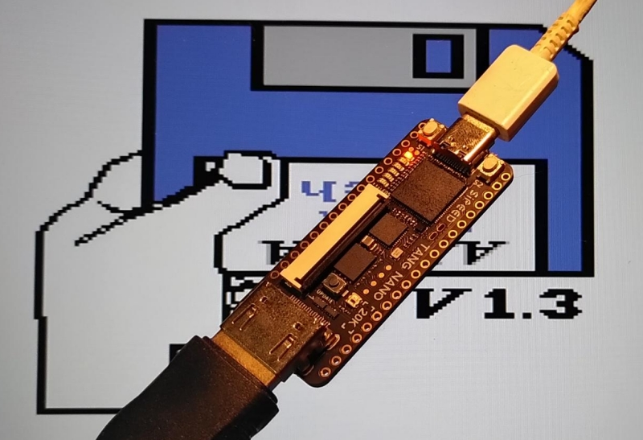
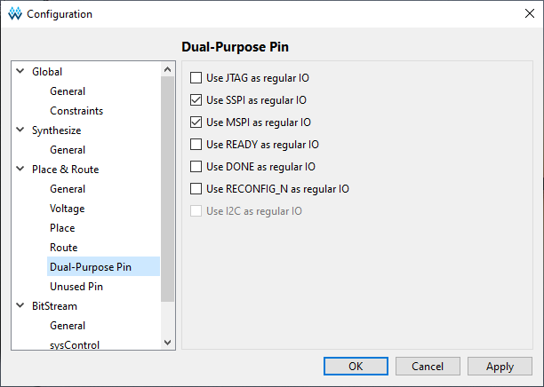

# NanoMig

NanoMig is a port of the [Minimig](https://en.wikipedia.org/wiki/Minimig) Commodore Amiga FPGA implementation to the [Tang Nano 20K](https://wiki.sipeed.com/hardware/en/tang/tang-nano-20k/nano-20k.html), [Tang Primer 25K](https://wiki.sipeed.com/hardware/en/tang/tang-primer-25k/primer-25k.html), [Tang Mega 138K Pro](https://wiki.sipeed.com/hardware/en/tang/tang-mega-138k/mega-138k-pro.html) and [Tang Console with Mega 60k / 138k module](https://wiki.sipeed.com/hardware/en/tang/tang-console/mega-console.html) FPGA development boards.



This is based on the [MiSTeryNano project](https://github.com/harbaum/MiSTeryNano/) and also relies on a [FPGA companion](http://github.com/harbaum/FPGA-Companion) to be connected to the FPGA board for USB support and on-screen-display control.

This is still a work in progress. The current version is based on the [MiSTer Minimig AGA code](https://github.com/MiSTer-devel/Minimig-AGA_MiSTer) and runs many Amiga games and demos.

Current state:

  * Minimig based on [MiSTer Minimig AGA](https://github.com/MiSTer-devel/Minimig-AGA_MiSTer)
  * Amiga 500 and Amiga 1000 modes
  * Kick ROM stored in flash ROM
  * Up to 2MB chip, 4MB fast and 1.5MB slow RAM
  * Accelerated 68020 support (in the works)
  * OCS and ECS chipset (no AGA on TN20K!)
  * ROM loader (Kickstart 1.3 / 3.1 / 3.2 / DiagRom)
  * Up to four virtual floppy drives
  * Floppy disk write support
  * HDMI video and audio, PAL and NTSC
  * Keyboard and mouse via USB
  * Joysticks via USB or DB9 ports 
  * Up to two virtual IDE hard disks, read and write support
  * Runs on [Tang Nano 20k](https://wiki.sipeed.com/hardware/en/tang/tang-nano-20k/nano-20k.html), [Primer 25K](https://wiki.sipeed.com/hardware/en/tang/tang-primer-25k/primer-25k.html), [Mega 138K Pro](https://wiki.sipeed.com/hardware/en/tang/tang-mega-138k/mega-138k-pro.html) and [Tang Console with Mega 60k / 138k module](https://wiki.sipeed.com/hardware/en/tang/tang-console/mega-console.html)
  * [Fully simulated](sim)

Planned features:

  * AGA support (is planned for the Arora III FPGA series e.g. GW3A-20)
  * Drive Sounds for FDD & HDD (hardware addon / buzzer)

Outlook:

  * RTG implementation
  * WIFI support
  * Flickerfixer

## Videos

These youtube shorts mainly document the progress:

  * [NanoMig #12: Changing kickstart via menu](https://youtube.com/shorts/6RkL1LHsOUQ)
  * [NanoMig #11: Tiny FPGA, big screen](https://youtube.com/shorts/DdKW_RedTvs)
  * [NanoMig #10: World of Commodore Amiga Demo on Tang Primer 25k](https://youtube.com/shorts/XdLlrg1wgko)

<details><summary>More ...</summary>
<ul>
  <li><a href="https://youtube.com/shorts/NHFjJwGAOZ0">NanoMig #9: Amiga speedball 2 on Tang Mega 138k Pro</a></li>
  <li><a href="https://youtube.com/shorts/9LJ0tsSZb60">NanoMig #8: Booting from virtual Harddisk</a></li>
  <li><a href="https://youtube.com/shorts/vbYURdxtEAQ">NanoMig #7: Tiniest Amiga running Gods</a></li>
  <li><a href="https://youtube.com/shorts/uFKjddN-WSA">NanoMig #6: First signs of life with the 68ec020</a></li>
  <li><a href="https://youtube.com/shorts/PSqerpTvJrw">NanoMig #5: Cheap FPGA Amiga finally runs Planet Rocklobster Demo</a></li>
  <li><a href="https://youtube.com/shorts/00sgeovKQa4">NanoMig #4: Running Amiga Pro tracker on the Tang Nano 20k</a></li>
  <li><a href="https://www.youtube.com/shorts/ZvdcHXi-k2g">NanoMig #3: Booting workbench for the first time on Tang Nano 20k</a></li>
  <li><a href="https://www.youtube.com/shorts/5n52x6f5NDI">NanoMig #2: USB keyboard and audio for the FPGA Amiga</a></li>
  <li><a href="https://www.youtube.com/shorts/ti7aLr5Kjqc">NanoMig #1: Amiga DiagROM booting on Tang Nano 20k</a></li>
</ul>
</details>

## What's needed?

The necessary binaries can be found in the [project releases](https://github.com/MiSTle-Dev/NanoMig/releases).

  * ```nanomig.fs``` needs to be flashed to the FPGA's flash memory
    * ```openFPGALoader -f nanomig.fs```
    * Currently supported are Tang Nano 20k with HDMI (```nanomig.fs```), Tang Nano 20k with RGB LCD (```nanomig_lcd.fs```), Tang Primer 25k (```nanomig_tp25k.fs```), Tang Mega 138k Pro (```nanomig_tm128k.fs```), Tang Console 60k (```nanomig_tc60k.fs```) and Tang Console 138k (```nanomig_tc128k_bl616.fs```)
  * On Nano 20k, Primer 25k and Console 60K 256kByte Kickstart 1.3 ```kick13.rom``` needs to be flashed to offset 0x400000 _and_ 0x440000 (identical file). On 138k boards use addresses 0x600000 and 0x640000 instead.  
  Note: 512kB Kickstart 1.3 ROMs at offset 0x400000 respectively 0x600000 for 138k.
    * ```openFPGALoader --external-flash -o 0x400000 kick13.rom```
    * ```openFPGALoader --external-flash -o 0x440000 kick13.rom```  
    See here for [checksums of known working Kickstart roms.](https://github.com/MiSTle-Dev/NanoMig/blob/main/doc/KICKSTART_ROMS.md)
  * For IDE HDD support 512kB Kickstart 3.1 ```kick31.rom``` needs to be flashed at offset 0x400000 (138k: 0x600000) only.
    * ```openFPGALoader --external-flash -o 0x400000 kick31.rom```
  * The [latest FPGA Companion firmware](http://github.com/harbaum/FPGA-Companion) needs to be flashed to the support MCU
    * Currenly supported are [M0S Dock (BL616)](https://github.com/harbaum/FPGA-Companion/tree/main/src/bl616), [Raspberry Pi Pico (RP2040)](https://github.com/harbaum/FPGA-Companion/tree/main/src/rp2040), [ESP32-S2/S3](https://github.com/harbaum/FPGA-Companion/tree/main/src/esp32)  
    and TN20k, Console 60k/138k, Primer25k, Mega138k Pro integrated [onboard BL616](https://en.bouffalolab.com/) MPU
  * A default ADF disk image named ```df0.adf``` should be placed on SD card (e.g. workbench 1.3)
  * For the SD card to work [all components incl. the support MCU](https://github.com/harbaum/NanoMig/issues/5) have to work properly
  * For preparation of HDF images the HST-Imager works best. [HST-Imager](https://github.com/henrikstengaard/hst-imager) 
  * Professional Filesystem 3 (PFS3) is recommended for HDDs. [PFS3](https://aminet.net/package/disk/misc/pfs3aio)
  * Use ADF-Opus to create and modify ADF images under Windows [ADFOpus2025](https://github.com/chironb/ADFOpus2025)
* With Disk Flashback you can mount ADF's & HDF's under Windows [Disk Flashback](https://robsmithdev.co.uk/diskflashback)


## Credits
Many thanks to **Alastair M. Robinson** ([robinsonb5](https://github.com/robinsonb5)) for his contributions to the **NanoMig**, in particular **Fastram** and **68020** cpu! 

## Build setting (Tang Nano 20K only!)
The core needs to be able to react on bl616 jtagsel Signal (all boards except tn20k).  
Only for the TN20K: **Use JTAG as regular IO** must be unselected in Gowin EDA Configuration!




## LED UI

| LED | function    | TN20K | TP25K |TM60K|TM138K Pro|Console60K/138k|
| --- |           - | -     | -     | -   |-         |-|
| 0 | POWER         | x     | x     | x   |x         |x|
| 1 | F.DISK        | x     | x     | x   |x         |x|
| 2 | H.DISK        | x     | -     |   - |x         |-|
| 3 | ???           | x     | -     |   - |x         |-|
| 4 | SD-READ       | x     | -     |   - |x         |-|
| 5 | SD-WRITE      | x     | -     |   - |x         |-|


## Amiga specific key mappings

| Amiga key | NanoMig key |
| --------- | ----------- |
| Left Amiga | Left meta (Windows) key |
| Right Amiga | Right meta / Page Down |
| Help | End / Insert |
