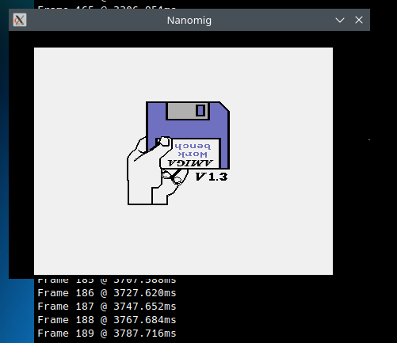
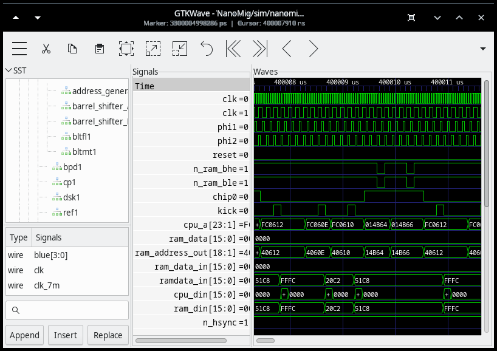

# NanoMig simulation

Debugging an FPGA can be quite challenging as the core runs on
real hardware and its internal states cannot easily be observed and
analyzed.

## Debugging the running FPGA

There are some ways to inspect signals inside the working FPGA. The
most obvious approach is to route these signals onto an external pin
in order to attach an oscilloscope or logic analyzer to this pin. The
approach is very limited as the number of signals that can be observed
is rather limited. Furthermore, routing internal signals to external
pins may require major temporary code changes which doesn't help
keeping the code in a consistent state. Furthermore, this approach
requires additional external hardware.

A more advanced approach uses the FPGA itself to inspect signals
during runtime. Tools like Gowins Analog Oscilloscope (GAO) or
Altera's signaltap allow the developer to implement a logic probe
inside the FPGA which can be used during runtime via a PC connected to
the FPGA to also observe signals inside the running FPGA. This
approach usually allows observing more signals. But it's still
limited in the number of signals that can be observed this
way. Furthermore, it needs its own resources inside the FPGA and most
importantly, signals cannot be exported to the PC in real time. Thus,
they are captured over a very limited to inside the FPGA and the
resulting data is transferred to the PC at a much lower rate. This
approach thus usually only allows to observer signals for a very short
timeframe.

These approaches can definitely be used to debug and analyze problems
with cores. But it can be very tedious and time-consuming.

## Simulations

It's possible to debug FPGA cores without even touching a real FPGA at
all. Most HDL tool chains come with the ability to simulate FPGA
designs. This approach also has some major disadvantages. One is that
this only simulates the FPGA itself, but doesn't know anything about
the peripherals like external RAMs, video, SD card, the entire IO
Companion etc. The FPGA core often does not do much without these
external components and e.g. many cores require a ROM images loaded
from external flash memory within the first milliseconds of operation
to do anything useful. Another big disadvantage is simulation speed.
These simulations run the electrical behavior of the FPGA at a very
high level of detail and thus are very CPU intense. The simulation can
easily run at many 1000th of the real speed. One second of real time
can easily require several hours to simulate. The fact that the retro
machines usually require up to a minute to boot can cause a single
simulation to run for days.

### Verilator

But there's something lighter than a full-fledged chip
simulation. Tool chains like verilator or GHDL allow compiling Verilog
or VHDL code into executable code able to be run on a PC. This very
much resembles the aforementioned detailed chip simulations. But the
resulting PC code runs much faster than the full
simulation. Furthermore, it can easily be combined with other PC
program code allowing to implement simulations of external hardware.
E.g. the simulation may open a window on the PC to simulate video
output or use the PC's file system to simulate an SD card. The
downside is that this approach only simulates the fundamental logic of
the FPGA but not physical chip limits like speed and size limitations.
A verilator simulation thus cannot show if a design would not run fast
enough on a real FPGA or if its design will fit into the FPGA at all.

# Simulating NanoMig (and other cores)

The fact that the entire Minimig and the fx68k CPU core are written in
Verilog allows them to be run in a verilator simulation on a Linux PC.
This directory contains such a solution.

Currently implemented in this test bench are:

 - The complete Minimig including the fx68k core
 - SDRAM and ROM simulation
 - Video output via SDL
 - Floppy disk emulation
 - IDE HDD emulation incl. write support (tested with kick 3.1)
 - SD card emulation
 - UART emulation (for e.g. diagnostic output of DiagROM)
 - Includes a skeleton for a [custom test rom](test_rom)

Some of these features can be enabled and disabled in the
```Makefile``` and in ```nanomig_tb.cpp``` itself. Not all options are
always tested and some changes in the HDL core may be broken some
tests. By default, the simulation is configured for video emulation in
endless operation. This means that running the simulation will not
output any wave data but will instead just run with emulated
video. Using a kickstart 1.3 ROM this will e.g. display the disk/hand
screen after having simulated 187 frames.



The [original fx68k core](https://github.com/ijor/fx68k) does not
work in verilator. This simulation thus includes a [variant
that runs on verilator](https://github.com/emoon/fx68x_verilator).

## Building and running

The simulation has only been tested on Linux.

It has been tested with Verilator 5.026 built from the [GitHub master
branch](https://github.com/verilator/verilator). Earlier versions,
especially the ones that come with some Linux distros are likely too
old. Newer versions will probably work. You'll need to adjust the
[Makefile](Makefile#L27) to point to your installed verilator setup.

For video simulation ```libsdl2``` is needed.

### Additional files needed

At least a kickstart (e.g. 1.3) ROM named ```kick13.rom``` is needed
to run the simulation, HDD emulation has only been tested with
kickstart 3.1.  Other ROMs like
[DiagROM](https://github.com/ChuckyGang/DiagROM) may also work, although
 the video simulation is far from being complete and e.g. the
video output of DiagROM is broken. However, UART output can be enabled
allowing to see the initial diagnostic output of DiagROM.

Further simulation features like e.g. floppy simulation may
need additional files like e.g. ADF disk images. See the
[```nanomig_tb.cpp```](nanomig_tb.cpp) for details.

With all dependencies in place a simple ```make run``` should build
the simulator and run it.

### Verilator version notes

Starting with Verilator 5.038 the default behavior for handling ```unique```
statements changed: [verilator/verilator-announce#77](https://github.com/verilator/verilator-announce/issues/77).  
Earlier versions did run without these assertions per default. 

This will lead to the error when running the simulation:
```
[0] %Error: fx68kAlu.sv:313: Assertion failed in TOP.nanomig_tb.nanomig.cpu_wrapper.cpu_inst_o.excUnit.alu: unique case, but none matched for '32'h00000000'
%Error: fx68x_verilator/fx68kAlu.sv:313: Verilog $stop
```

Workarounds are to use Verilator up to 5.036 or to add the parameter:
`--no-assert` to the command line of Verilator in the Makefile
```
verilator --no-assert -O3 -Wno-fatal --no-timing --trace --threads 1 --trace-underscore  -top-module \$(PRJ)\_tb \$(VERILATOR\_FLAGS) -cc \${HDL\_FILES} --exe \${CPP\_FILES} -o ../\$(PRJ) -CFLAGS "\${EXTRA\_CFLAGS}" -LDFLAGS "\${EXTRA\_LDFLAGS}"
```

## Running traces

The Verilator simulation has two operation modes. It can only run the
simulation itself, or it can write out traces of all signals. Running
without tracing is somewhat faster. Therefore, tracing is typically
only enabled for a certain time frame. E.g. if some floppy disk problem
is to be analyzed, then only the 100ms time frame around the moment
where floppy access takes place in the simulation is written to traces.

Tracing can be enabled in [```nanomig_tb.cpp```](nanomig_tb.cpp#L47) by
setting the following lines like e.g.:

```
#define TRACESTART   0.4
#define TRACEEND     (TRACESTART + 0.2)
```

This will start writing out a trace file after 0.4 seconds of simulated run
time, and it will write a trace for 0.2 seconds of runtime. The traces
will be ~1 GBytes per 100ms simulated runtime.

The resulting VCD trace can e.g. be loaded into
[gtkwave](https://gtkwave.sourceforge.net/) for further inspection.



## Floppy disk and IDE HDD simulation

The floppy disk as well as the IDE HDD is simulated including the SD
card itself.

Floppy simulation is by default enabled and expects a file named
```df0.adf``` to be present. This will then be inserted as DF0. If no
such file is present, then the simulation behaves as if no disk is
inserted in the Amiga kick displays the disk/hand logo after around 3
seconds simulation time. The images to be used for floppy and HDD
simulation can be set in the file [```sd_card_config.h```](sd_card_config.h).

When booting the floppy will first be accessed at around 3 seconds
simulation time with plenty of debug output about disk IO on the
console.

## Providing your own test cases

If you want to report a bug in the core, then it's very helpful
to provide test cases that can be run in the simulation. These test
cases should come in the form of a self running ADF floppy disk
image. Self-running means that the ADF can be loaded into the
simulation, and it runs up to the issue it's demonstrating any user
interaction required. This is needed since the simulation does not
support Keyboard or mouse input.

For example when debugging the floppy disk write routines, a regular
workbench ADF image was taken and a startup file was added that would
copy a test file from floppy to floppy on startup. Under Linux such a
disk can be created using
[```rdbtool```](https://github.com/cnvogelg/amitools/blob/main/docs/tools/rdbtool.rst)
like so:

```
DF0=fdwrtest.adf
cp wb13.adf $DF0
echo "ECHO \"Writing test.txt\"" > startup
echo "COPY DF0:test.txt DF0:test2.txt" >> startup
echo "TYPE DF0:test2.txt" >> startup
echo "Test Text" > test.txt
xdftool $DF0 delete S/Startup-Sequence
xdftool $DF0 write startup S/Startup-Sequence
xdftool $DF0 write test.txt test.txt
```

The resulting ```fdwrtest.adf``` can be run inside the
Verilator simulation just like any other disk by specifying it in the
[```sd_card_config.h```](sd_card_config.h) file.

Creating such test images is not NanoMig or MiSTle specific. These ADF
image can be created and run on emulators like WinUAE and even on real
hardware.

Since the Verilator simulation can be quite slow and often need to be
run many times when trying to fix the issue, it's very helpful if
these test images expose the issue to be debugged as early in the boot
process as possible.

## Screenshots

With video emulation enabled all frames are written to the
[screenshots](screenshots) directory in PNG format.
