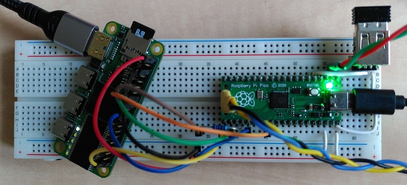
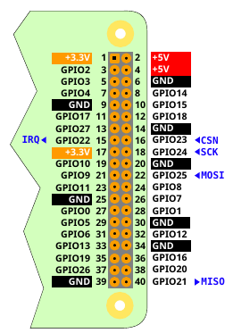

# NanoMig for Lattice ECP5 on ICEPi-Zero

This is a port of NanoMig to the [Lattice ECP5 FPGA family](https://www.latticesemi.com/en/Products/FPGAandCPLD/ECP5) and especially to the [LFE5U-25F](https://www.latticestore.com/products/tabid/417/categoryid/9/productid/122785/searchid/1/default.aspx?searchvalue=lfe5u*-25f-*bg256) on the [Icepi-Zero](https://github.com/cheyao/icepi-zero).

## Current state

  - NanoMig working
  - IDE temporarily disabled due to excessive logic usage
  - Joysticks and Companion through GPIO
  - Temporary work-around for [flash clock issues](tests)
  - HDMI signal are driven by logic. Should finally use DDR HW serializers or the like
  - Uses OSD menu config from Gowin setup. Needs a custom config

## Setup

Joystick 0 and 1 are mapped to the GPIO as well as the Companion interface. Below
is the mapping of the companion interface.

This can e.g. connected to the [RP2040 variant](https://github.com/MiSTle-Dev/FPGA-Companion/tree/main/src/rp2040) as seen in the photo of the breadboard setup above. For reliability, the SCK connection should not be wired directly but via a 220 ohms series resistor.
