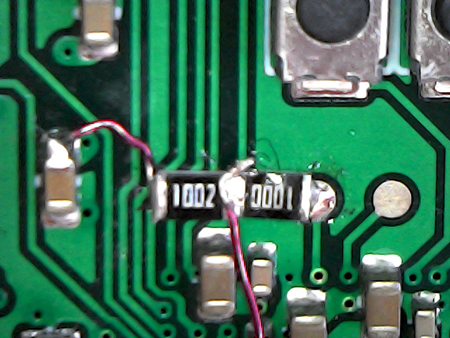

# Flash clock issues

The MiSTle projects usually store ROM files like the Amigas kickstart
inside the FPGAs configuration flash memory. This requires the core
to get access to this once the system has booted.

Lattice provides a special mechanism to access the flash clock signal
as described in [section 6.1.2 of the ECP5 and ECP5-5G sysCONFIG User Guide](https://www.latticesemi.com/view_document?document_id=50462).
However, I have not been able to get this working with the Synplify Pro synthesis in Lattice Diamond.

This test setup demonstrates the issue. It will output a clock signal
on the flash clk pin when synthesized with Lattice LSE, but not signal
is output then using Synplify Pro.

As a quick work-around I've wired the IcePi-Zeros TP2 through a 100 ohms
resistor to pin 6 of the flash chip. An additional 10k pull-up to 3.3V is also
needed to make this work reliably:

